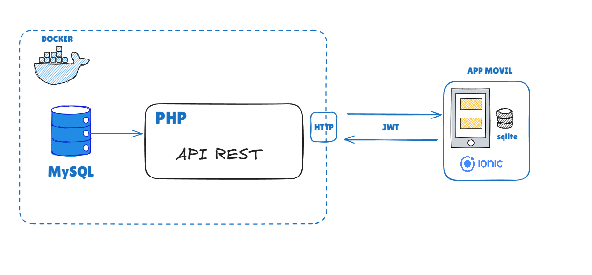
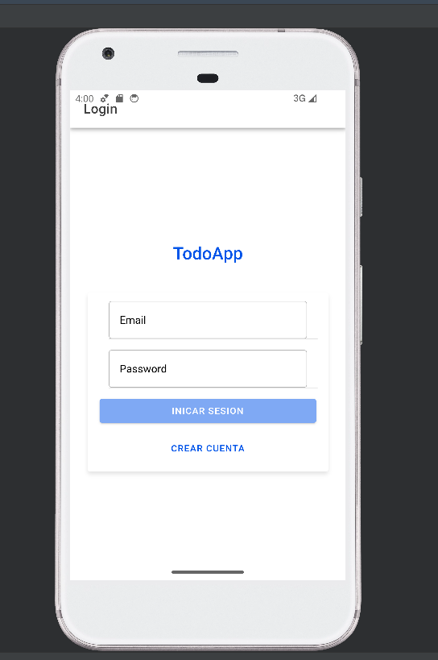

# TodoApp  Setup
 [link-video](https://streamable.com/ld5gfs)
## Estructura de solucion

## Services
- ** Docker **
- **Web**: PHP 8.3 with Apache (Port 8080)
- **Database**: MySQL 8.0 (Port 3306)
- **phpMyAdmin**: Database management (Port 8081)
- **App Mobile** : Ionic
## Ejecutar Poryecto

1. Build and start all services:
```bash
docker-compose up --build -d
```

2. View running containers:
```bash
docker-compose ps
```

3. View logs:
```bash
docker-compose logs web
docker-compose logs db
```

## Access Points
- **Main App**: http://localhost:8080
- **phpMyAdmin**: http://localhost:8081
- **FrontEnd Web**: http://localhost:4200

## Database Credentials
- **Host**: db
- **Database**: todoapp
- **Username**: todouser
- **Password**: todopass
- **Root Password**: rootpassword

## init sql

`` code

CREATE TABLE IF NOT EXISTS users (
    id INT AUTO_INCREMENT PRIMARY KEY,
    name VARCHAR(255) NOT NULL,
    email VARCHAR(255) NOT NULL UNIQUE,
    password VARCHAR(255) NOT NULL,
    created_at TIMESTAMP DEFAULT CURRENT_TIMESTAMP,
    updated_at TIMESTAMP DEFAULT CURRENT_TIMESTAMP ON UPDATE CURRENT_TIMESTAMP,
    INDEX idx_email (email)
);

CREATE TABLE IF NOT EXISTS tasks (
    id INT AUTO_INCREMENT PRIMARY KEY,
    user_id INT NOT NULL,
    title VARCHAR(255) NOT NULL,
    description TEXT,
    completed BOOLEAN DEFAULT FALSE,
    created_at TIMESTAMP DEFAULT CURRENT_TIMESTAMP,
    updated_at TIMESTAMP DEFAULT CURRENT_TIMESTAMP ON UPDATE CURRENT_TIMESTAMP,
    FOREIGN KEY (user_id) REFERENCES users(id) ON DELETE CASCADE,
    INDEX idx_user_id (user_id),
    INDEX idx_completed (completed)
);


``

## Ejecutar  App

```bash
 cd app
 npm i -g @ionic/cli
 npm install
 ionic build
 npx cap add android
 npx cap sync
 npx cap open android
```

